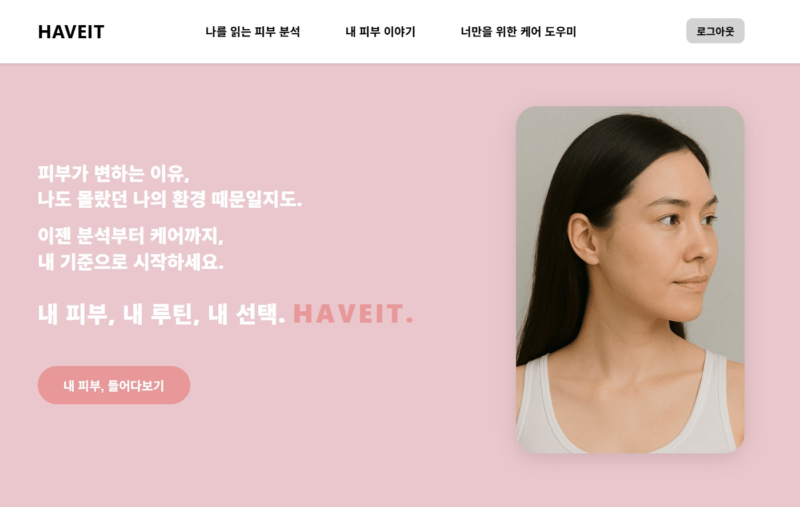
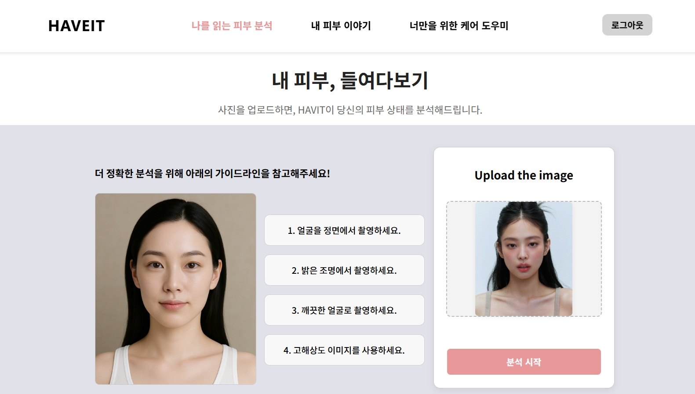
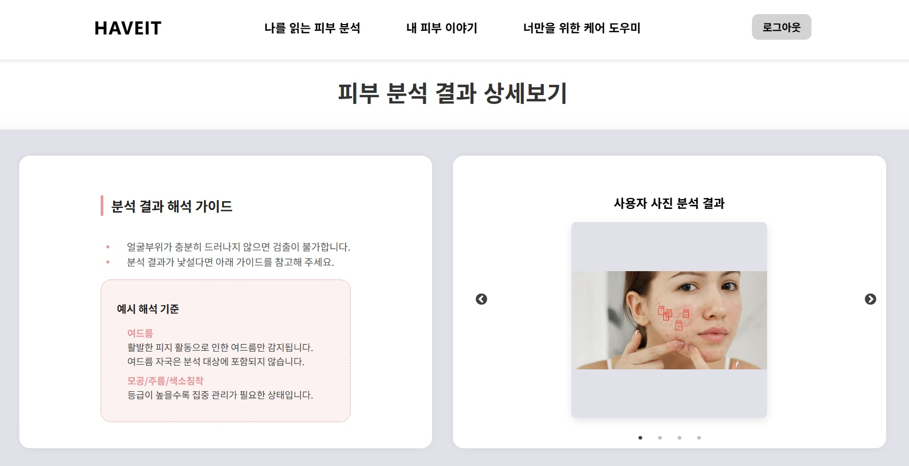
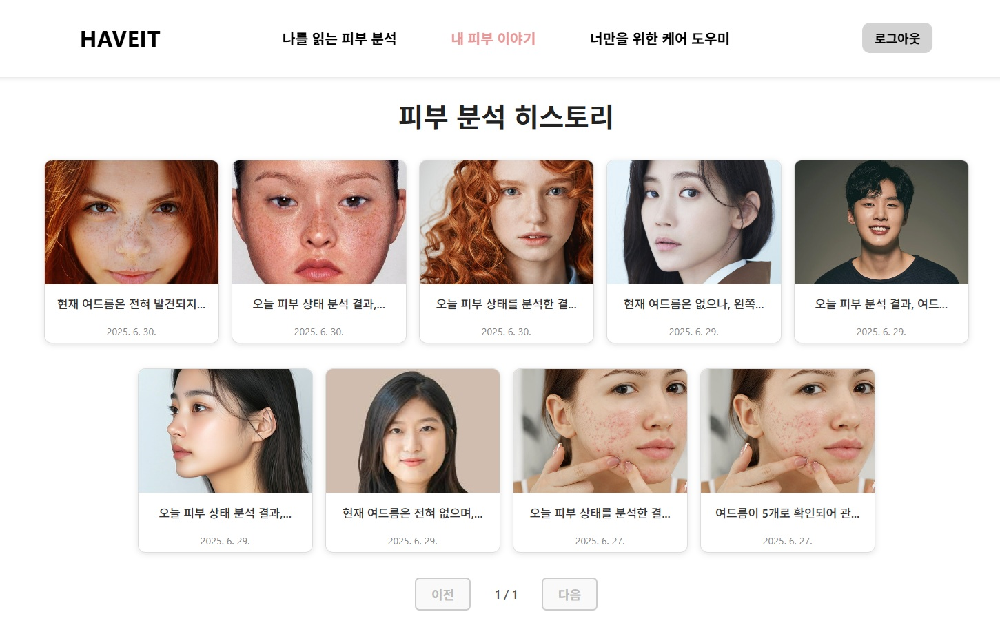
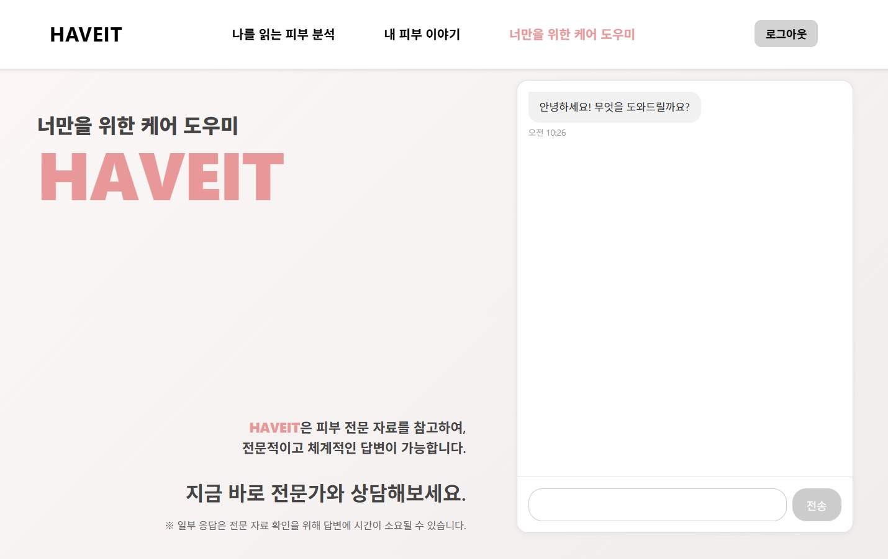

# HaveIt Frontend

🌐 **배포 URL**: [https://onepm-2025.shop/](https://onepm-2025.shop/)

## 📋 프로젝트 개요

HAVEIT은 AI 기반 피부 분석 및 챗봇 서비스를 제공하는 React 웹 애플리케이션입니다. 사용자는 사진을 업로드하여 피부 상태를 분석받고, 피부 전문 챗봇과 상담할 수 있습니다.

## 🚀 시작하기

### 필수 요구사항
- Node.js 16.0.0 이상
- npm

### 설치 및 실행

1. **저장소 클론**
   ```bash
   git clone [https://github.com/paesir-i-am/haveit_full_front]
   cd haveit_full_front
   ```

2. **의존성 설치**
   ```bash
   npm install
   ```

3. **개발 서버 실행**
   ```bash
   npm start
   ```

4. **브라우저에서 확인**
   - [http://localhost:3000](http://localhost:3000)에서 애플리케이션 확인

## 📝 개발 환경

### 개발 도구
- **Node.js**: 16.0.0 이상
- **npm**: 8.0.0 이상

### 개발 서버
- **포트**: 3000 (기본값)
- **환경**: React Development Server

### 빌드 환경
- **프로덕션 빌드**: `npm run build`
- **테스트 실행**: `npm test`
- **ESLint**: React App 기본 설정

## 🛠 기술 스택

### Frontend
- **React 18.3.1** - 사용자 인터페이스 구축
- **Redux Toolkit** - 상태 관리
- **React Router DOM** - 라우팅
- **Sass** - 스타일링
- **Axios** - HTTP 클라이언트

### Visualization
- **Recharts** - 차트 시각화
- **React Slick** - 캐러셀 컴포넌트

## 📁 프로젝트 구조

```
src/
├── common/                 # 공통 컴포넌트 및 유틸리티
│   ├── api/               # API 통신 모듈
│   ├── components/        # 공통 컴포넌트
│   ├── hook/             # 커스텀 훅
│   ├── pages/            # 공통 페이지
│   ├── router/           # 라우팅 설정
│   ├── slice/            # Redux 슬라이스
│   └── util/             # 유틸리티 함수
├── chat/                  # 챗봇 기능
│   ├── api/              # 챗봇 API
│   ├── component/        # 챗봇 컴포넌트
│   └── pages/            # 챗봇 페이지
├── skinAnalysis/          # 피부 분석 기능
│   ├── api/              # 피부 분석 API
│   ├── component/        # 피부 분석 컴포넌트
│   ├── pages/            # 피부 분석 페이지
│   └── util/             # 피부 분석 유틸리티
└── App.js                # 메인 앱 컴포넌트
```

## 🚀 주요 기능

### 1. 🔐 회원 관리 (Member)
- **카카오 소셜 로그인**: OAuth2를 통한 카카오 계정 연동
- **JWT 인증**: Access Token과 Refresh Token 기반 인증
- **회원 정보 관리**: 프로필 정보 저장 및 관리

### 2. 📸 피부 분석 (Skin Analysis)
- **이미지 업로드**: 멀티파트 파일 업로드 (최대 10MB)
- **AI 분석**: FastAPI 서버와 연동하여 피부 상태 분석
- **분석 결과 저장**: 여드름, 모공, 주름, 색소침착 등 상세 분석 결과 저장
- **분석 히스토리**: 사용자별 분석 기록 조회 및 페이징 처리

### 3. 💬 챗봇 서비스 (Chatbot)
- **AI 챗봇**: FastAPI 서버와 연동한 피부 관리 상담 챗봇
- **세션 관리**: 사용자별 대화 세션 관리 및 타임아웃 처리
- **대화 기록**: 세션별 대화 로그 저장 및 조회

## 📱 주요 페이지

### 메인 페이지 (`/`)
- 프로젝트 소개 및 슬로건
- 피부 분석 및 챗봇 서비스 안내
- 애니메이션 효과가 적용된 인터랙티브 UI



### 피부 분석 (`/skin-analysis`)

#### 업로드 페이지 (`/skin-analysis/upload`)
- 사진 업로드 및 분석 가이드라인
- 분석 진행 상태 표시



#### 결과 페이지 (`/skin-analysis/result`)
- 분석 결과 시각화 및 상세 정보
- 차트 및 바운딩 박스 표시



#### 히스토리 페이지 (`/skin-analysis/history`)
- 이전 분석 결과 조회
- 분석 히스토리 목록



### 챗봇 상담 (`/chat`)
- 실시간 AI 챗봇과의 대화
- 피부 전문 지식 기반 상담
- 대화 히스토리 관리


